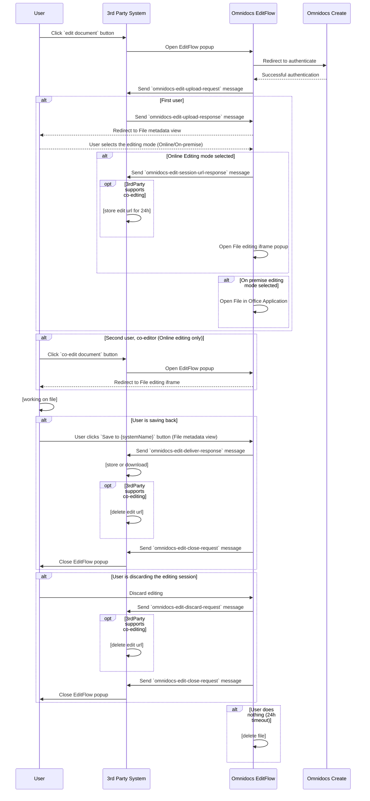

# Omnidocs Edit Flow
The Edit Flow is a client-side integration utilizing the PostMessage API, designed to facilitate document editing within a popup-based workflow. It enables seamless communication between the third-party frontend and the Edit Flow frontend, supporting:
* Online editing via the WOPI protocol
* On-premise editing via the WebDAV protocol

This flow includes authentication, file uploads to blob storage, and secure document editing, ensuring compliance with WOPI and WebDAV standards.

## Workflow & UI Behavior
To adhere to WOPI UI guidelines, the flow involves two popups:

1. First Popup: Displays an overview of the document and presents decision buttons for editing options.
2. Second Popup (WOPI Editing Only): Opens a WOPI iFrame for online document editing.

When editing via on-premise applications (using WebDAV) the related Office application is launched directly for editing.

## Prerequisites
1.	Secure Hosting: The Edit Flow must be hosted on HTTPS to ensure secure communication.
2.	Third-Party Application Compatibility:
    * Must support custom components and JavaScript.
    * Must be capable of opening popups and using the PostMessage API.
3.  Authentication & Tenancy: 
    * An Omnidocs Create Tenancy with authentication configured is required.
    * The AuthDomain (subdomain) parameter is necessary to initiate the first Edit Flow popup and can be retrieved from the Omnidocs Create Tenant.
4.  Co-Editing Support (Optional): If co-editing is to be supported, the third-party application must have the capability to store the co-editing URL for an online editing session.

## How it works?
The integration communicates with the Edit Flow application via the PostMessage API. The messages exchanged and the user flow are described in the following steps:
1. <b>User Action</b>: The user initiates the process by clicking the "Edit Document" button in the third-party system.
2. <b>Popup Initiation</b>: The third-party system opens a popup for the Edit Flow.
3. <b>Authentication</b>: The user is presented with an authentication dialog based on the Create Tenant configuration.
4. <b>Successful Authentication</b>: Once authenticated, an `omnidocs-edit-upload-request message` is sent to the third-party system. The third party must respond with an `omnidocs-edit-upload-response` message containing:
    * The file for editing (Base64 encoded)
    * The file name
    * The source system parameter
    * Additional metadata to be displayed to the user
    * The AutoOpenEditorType parameter, which defines whether the editing session should start automatically (values: 'WOPI/Desktop'). This is optional; if not provided, the editing session will not open automatically.
    * The ShowUIActions parameter, which specifies the available editing actions for the end-user (values: ["WOPI", "Desktop"]). This is optional; if not provided, all editing actions will be available.
5. <b>Redirection to File Metadata Overview</b>: The first application popup displays the document's metadata and presents four user button actions:
    * `Edit using Microsoft 365 for the web` – Opens a second popup with the WOPI frame for editing.
    * `Edit in {ApplicationType} for the desktop` - Opens an MS Office application for editing. 
    * `Save back to {SourceSystem}` – Saves the current state of the uploaded document.
    * `Discard` – Discards any changes made to the uploaded document.
6. <b>Opening the Editing Popup</b>: When the `Edit using Microsoft 365 for the web` button is clicked, a second popup opens for document editing. At this stage, Edit Flow responds with the `omnidocs-edit-session-url-response` containing a co-editing URL, allowing the third-party system to store it for additional users to join the session.
7. <b>Another User Joins the Editing Session to Co-Edit:</b>: The user clicks the co-editing URL in the third-party system. The editing popup opens immediately. Only the first user can make decisions regarding the file state; all other users can collaborate only.
8. <b>Opening the File via WebDAV:</b> When `Edit in {ApplicationType} for the desktop` button is pressed, the designated MS Office application opens for editing. 
    * Since WebDAV does not support co-editing, the `omnidocs-edit-session-url-response` will not be sent to the third-party system.
9. <b>Completing the Editing Session</b>: Once editing is complete, the user must take action in the file metadata overview popup:
    *  `Save back to {SourceSystem}` Clicked. The `omnidocs-edit-deliver-response` message is sent to the third party, containing the download URL with the latest edited file version.
        At this stage, the 3rd Party can close the popup. 
    * `Discard` Clicked. The `omnidocs-edit-discard-request` message is sent, instructing the third party to close the popup without saving changes.
    * After performing either of the actions above, the `omnidocs-edit-close-request` is sent to the third party, indicating that the popup can be closed.
10. <b> User closes the file metadata overview popup</b>: Edit Flow displays an alert asking if the session should be terminated. If the user clicks OK, the `omnidocs-edit-discard-request` is sent to the third-party system, notifying it to close the popup.

### Sequence Diagram


### Class diagrams
```mermaid
const uploadRequest = {
    eventType: 'omnidocs-edit-upload-request',
    correlationId: 'correlationId'
};
const uploadResponse = {
    eventType: 'omnidocs-edit-upload-response',
    fileBase64: 'base64FileString',
    fileName: 'name',
    systemName: 'systemName',
    additionalData: {},
    AutoOpenEditorType: 'WOPI/Desktop', /*OPTIONAL*/
    ShowUIActions: ["WOPI", "Desktop"] /*OPTIONAL*/,
    correlationId: 'correlationId'
};
const editSessionUrlResponse = {
    eventType: 'omnidocs-edit-session-url-response',
    editUrl: 'URL-for-co-editing',
    correlationId: 'correlationId'
}
const deliverResponse = {
    eventType: 'omnidocs-edit-deliver-response',
    downloadUrl: 'download-url',
    correlationId: 'correlationId'
}
const closeRequest = {
    eventType: 'omnidocs-edit-close-request',
    correlationId: 'correlationId'
};
const discardEvent = {
    eventType: 'omnidocs-edit-discard-event',
    correlationId: 'correlationId'
}
```

## How to use the example application
1. Obtain the authentication domain for EditFlow from Omnidocs Create tenant.
2. Clone this repository to your local machine.
3. Navigate to the folder containing the cloned repository and run:
```
npm i && npm start 
```
4. Open your browser and go to http://localhost:8080.
5. Enter the Edit URL in the format https://wopi.synapseomnidocs.com/details?authDomain={omnidocsDomain}, replacing {omnidocsDomain} with the authentication domain obtained in Step 1.
6. Fill out the additional metadata in JSON format to include for the UI. (Optional)
7. Click the Choose the file for editing button and select the file you want to edit.
8. Click the Open Omnidocs EditFlow button to begin editing.
9. Make the necessary changes to the document within the editing session.
10. If the document needs to be co-edited, copy the co-editing link from the Co-edit link field.
11. Once editing is complete, the download link for the updated file will be available, including all changes made during the session.

## Important notes:

<b>WOPI iFrame Editing & Auto Save</b>: Auto Save is enabled, which may cause delays in saving changes back to Edit Flow. This is a native behavior of the WOPI Auto Save function.
To ensure the latest version of the file is saved, users should press Ctrl + S in the iFrame before clicking Save back to {SourceSystem}. This will trigger the native WOPI Save functionality.

<b>Editing Session Duration</b>: Sessions can last up to 24 hours. After this period, the file will be removed from blob storage.
A notification will inform users about this during the workflow.

<b>Network & Security:</b> No firewall ports need to be opened for server-side communication.

<b>Editing Restrictions:</b> Once a document is opened on-premise, it cannot be edited online.

<b>User Roles & Collaboration:</b> Only the first user can decide the file state.
All other users can co-edit and collaborate on the document.

<b>Download URL one time usage</b> The download URL provided by EditFlow can only be used once.

<b>Automating Editing Session Launch:</b>  (Optional parameter) You can automate both on-premise and online editing by setting AutoOpenEditorType to 'WOPI/Desktop' in the omnidocs-edit-upload-response message parameter.

<b>Enabling UI Action buttons</b>  (Optional parameter) You can control the available editing options for end-users by setting ShowUIActions to 'WOPI/Desktop' in the omnidocs-edit-upload-response message parameter.

<b>Correlation ID and Co-Edit Session Cleanup</b> It is recommended to include a correlationId in the requests, which can be saved as a tag or metadata entry on the files. This allows tracking of which files no longer have an ongoing edit session. Additionally, it is the responsibility of the third-party implementers to clean up the saved co-edit session URL when correlating requests are sent, such as discard and save requests.