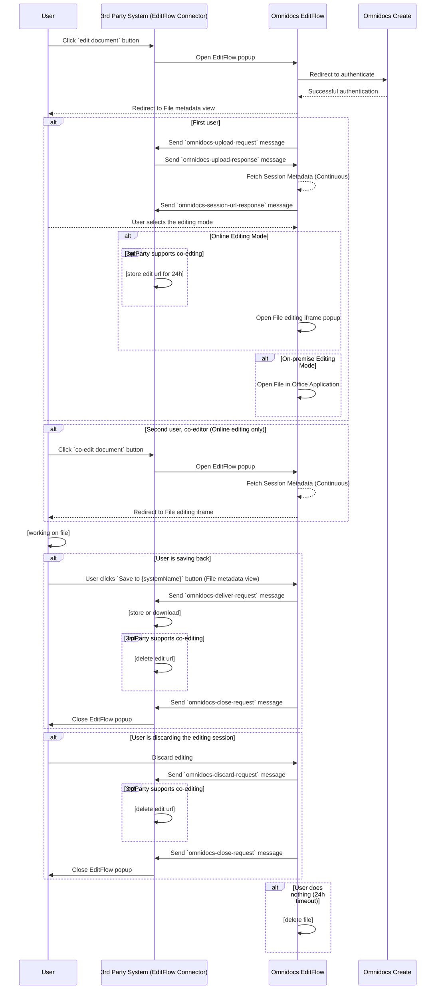
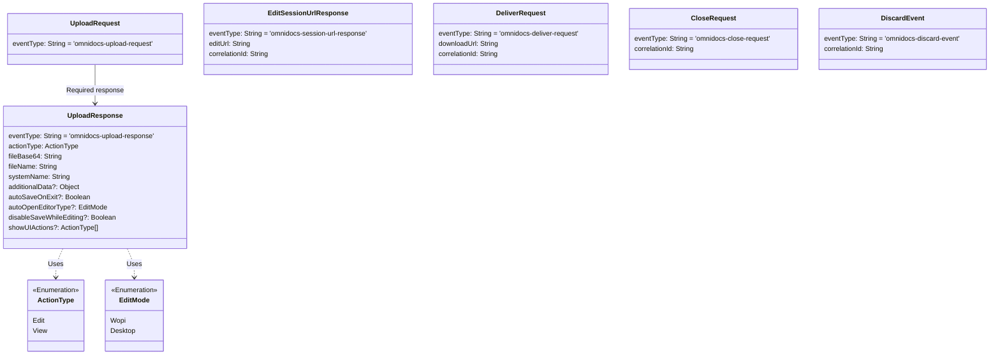

# Omnidocs EditFlow
The EditFlow Connector is a client-side integration utilizing the PostMessage API, designed to facilitate document editing within a popup-based workflow, enabling seamless communication with the EditFlow frontend.

The full flow includes authentication, file uploading to the specified storage provider, and secure document editing - supporting online editing via the WOPI protocol and desktop (on-premise) editing via the WebDAV protocol, fully compliant with their respective standards.

## Workflow and UI Behavior
Due to protocol restrictions and strict UI guidelines, the flow involves two windows.

### File Overview Window
Displays an overview of the document and presents decision buttons for editing options.

### Editing Window
Depending on the mode of editing, the second window will be either 1. a new popup window containing a WOPI iFrame (online editing), or, 2. the respective Office application, launched directly on the desktop (desktop editing). <br/> 
Note that co-editing is not available when editing on the desktop.

## Prerequisites

### Third-Party Connector Application Compatibility
Your third-party application must support custom components and JavaScript, and must be capable of opening popups as well as using the PostMessage API.

#### Co-Editing Support
To support co-editing, the third-party application must be able to store the co-editing URL for an online editing session.

### Authentication & Tenancy
The EditFlow application requires an active Omnidocs Create Tenancy with authentication configured. When first opening and initiating communication with the EditFlow application, you must pass the required query parameter `?authDomain={YOUR_CREATE_TENANT}` and authenticate with Omnidocs Create.

## How it works
Your third-party system communicates with the EditFlow application via the PostMessage API. The messages exchanged and the user flow, as they appear in this example application, are described in the following steps:

### Initialization 

1. <b>User Action</b> <br/> The user initiates the process by clicking the "Edit Document" button in the third-party system.
2. <b>Popup Initiation</b> <br/> The third-party system opens a popup for the EditFlow.
3. <b>Authentication</b> <br/> The user is presented with an authentication dialog based on the Create Tenant configuration.
4. <b>Successful Authentication</b> <br/> Once authenticated, an `omnidocs-upload-request message` is sent to the third-party system. 
5. <b>File Upload</b> <br/> The third party responds with an `omnidocs-upload-response` message, described in detail in [Nota Bene - Session Configuration](#session-configuration).
6. <b>Redirection to File Metadata Overview</b> <br/> After recieving a well-formed `uploadResponse`, the primary application window will respond with an `omnidocs-session-url-response`, which contains a url linking to the File Metadata Overview for the session, that can be used to join the session. 
7. <b>File Metadata Overview</b> <br/> The primary EditFlow window will then display the document information and present the user with the following actions:
* `Edit using Microsoft 365 for the web` – Opens a second browser window for editing, containing a WOPI iFrame.
* `Edit in {ApplicationType} for the desktop` - Opens an MS Office application for editing. 
* `Save back to {SourceSystem}` – Saves the current state of the uploaded document.
* `Discard` – Discards any changes made to the uploaded document.

The session is now ongoing, and the user guides the flow.

### Active Session
Based on the user's actions, you may need to receive and/or respond to messages from the EditFlow application. As the user selects a specific editing method, the other editing method will be disabled for the session.

#### Online Editing
When the `Edit using Microsoft 365 for the web` button is clicked, a second popup opens for document editing.

##### Another User Joins the Editing Session to Co-Edit
<b>Requires co-editing support.</b> Another user may join the online editing session by navigating to the co-editing URL generated above. After authentication, the user lands on the File Metadata Overview.

#### Opening the File via WebDAV 
When `Edit in {ApplicationType} for the desktop` button is pressed, the designated MS Office application opens for editing. <br/> Note that as the WebDAV protocol does not allow for co-editing, only one user is able to edit the file at a time, and any users sharing the session will be unable to collaborate.

#### Completing the Editing Session
The user can end the editing session from the primary window in the following ways:

##### Saving the file
The `omnidocs-deliver-request` message is sent to the third party, containing the download URL with the latest edited file version. Then, an `omnidocs-close-request` is sent to the third party, indicating that the session is terminated and the primary window can be closed.

##### Discarding the session
Firstly, the file is deleted from the server. Next, the `omnidocs-discard-request` message is sent, instructing the third party to close the popup without saving. An `omnidocs-close-request` is sent to the third party, indicating that the primary window can be closed.

### Relevant Illustrations
Below you may find a visualization of the flow and an overview of the message objects involved.

#### Sequence Diagram
Below is a sequence diagram detailing the flow between the user, the third-party system, the EditFlow application, and the Omnidocs Create application. <br/> 
Note the alternative and optional flows, denoted `alt` and `opt`, respectively.


```mermaid
sequenceDiagram
    participant User as User
    participant 3rdParty as 3rd Party System (EditFlow Connector)
    participant EditFlow as Omnidocs EditFlow
    participant Creat as Omnidocs Create
    
    User ->> 3rdParty: Click `edit document` button
    3rdParty ->> EditFlow: Open EditFlow popup
    EditFlow ->> Creat: Redirect to authenticate
    Creat -->> EditFlow: Successful authentication
    EditFlow -->> User: Redirect to File metadata view
    
    alt First user
        EditFlow ->> 3rdParty: Send `omnidocs-upload-request` message
        3rdParty ->> EditFlow: Send `omnidocs-upload-response` message
        EditFlow -->> EditFlow: Fetch Session Metadata (Continuous)
        EditFlow ->> 3rdParty: Send `omnidocs-session-url-response` message
        User -->> EditFlow: User selects the editing mode
            alt Online Editing Mode
                opt 3rdParty supports co-edting
                    3rdParty ->> 3rdParty: [store edit url for 24h]
                end
                EditFlow ->> EditFlow: Open File editing iframe popup
            end
            alt On-premise Editing Mode
                EditFlow ->> EditFlow: Open File in Office Application
            end
    end

    alt Second user, co-editor (Online editing only)
        User ->> 3rdParty: Click `co-edit document` button
        3rdParty ->> EditFlow: Open EditFlow popup
        EditFlow -->> EditFlow: Fetch Session Metadata (Continuous)
        EditFlow -->> User: Redirect to File editing iframe
    end

    User ->> User: [working on file]
    alt User is saving back
        User ->> EditFlow: User clicks `Save to {systemName}` button (File metadata view)
        EditFlow ->> 3rdParty: Send `omnidocs-deliver-request` message 

        3rdParty ->> 3rdParty: [store or download]
        opt 3rdParty supports co-editing
            3rdParty ->> 3rdParty: [delete edit url]
        end

        EditFlow ->> 3rdParty: Send `omnidocs-close-request` message 
        3rdParty ->> User: Close EditFlow popup
    end
    alt User is discarding the editing session
        User ->> EditFlow: Discard editing
        EditFlow ->> 3rdParty: Send `omnidocs-discard-request` message
        opt 3rdParty supports co-editing
            3rdParty ->> 3rdParty: [delete edit url]
        end

        EditFlow ->> 3rdParty: Send `omnidocs-close-request` message 
        3rdParty ->> User: Close EditFlow popup
    end
    
    alt User does nothing (24h timeout)
        EditFlow ->> EditFlow: [delete file]
    end
```

#### Message Objects
Detailed below are the message objects sent between windows via `window.postMessage()`. A message object must have the appropriate `eventType` for each step in the process. Note that while not all messages require a response via `window.postMessage()`, they may still require your application to take action.


```mermaid
classDiagram
    class UploadRequest {
        eventType: String = 'omnidocs-upload-request'
    }
    class UploadResponse {
        eventType: String = 'omnidocs-upload-response'
        actionType: ActionType
        fileBase64: String
        fileName: String
        systemName: String
        additionalData?: Object
        autoSaveOnExit?: Boolean
        autoOpenEditorType?: EditMode
        disableSaveWhileEditing?: Boolean
        showUIActions?: ActionType[]
    }

    class EditSessionUrlResponse {
        eventType: String = 'omnidocs-session-url-response'
        editUrl: String
        correlationId: String
    }
    class DeliverRequest {
        eventType: String = 'omnidocs-deliver-request'
        downloadUrl: String
        correlationId: String
    }
    class CloseRequest {
        eventType: String = 'omnidocs-close-request'
        correlationId: String
    }
    class DiscardEvent {
        eventType: String = 'omnidocs-discard-event'
        correlationId: String
    }

    class ActionType {
        <<Enumeration>>
        Edit
        View
    }
    class EditMode {
        <<Enumeration>>
        Wopi
        Desktop
    }

    %% Relationships
    UploadRequest --> UploadResponse : Required response
    UploadResponse ..> ActionType : Uses
    UploadResponse ..> EditMode : Uses
```

## How to Use the Example Application
To use this EditFlow Connector example application, do the following steps:

1. Obtain the authentication domain for EditFlow from your Omnidocs Create tenant.
2. Clone this repository to your local machine.
3. Navigate to the folder containing the cloned repository and run `npm i` to ensure the necessary packages are up-to-date, followed by the command `npm start` to start the web-application.
4. Open your browser and go to `http://localhost:8080`.
5. Using the authentication domain obtained above, enter the Edit URL in the format `https://wopi.edit.omnidocs.cloud/details?authDomain={authenticationDomain}` .
6. Optionally, select your desired configuration options or fill out the additional metadata in JSON format to include for the UI.
7. Click the "Choose File" button and select the Office file you want to edit.
8. Click the "Open Omnidocs Edit" button to begin the session.
9. In the session popup, choose your editing method. `Online` or `Desktop`.
10. Make the necessary changes to the document within the editing session.
11. If the document needs to be co-edited, copy the co-editing link from the "co-edit link" field. (Online editing only.)
12. Once editing is complete, either `Save` or `Discard` your changes. When choosing `Save`, the edited file will be available (including changes made during the session) through the single-use download link.

## Nota Bene

### General 
<b>Correlation ID and Co-edit Session Cleanup:</b> <br/> We recommend keeping track of the `correlationId` received in the `editSessionUrlResponse`. This allows tracking of which files no longer have an ongoing edit session. Additionally, it is the responsibility of the third-party system to keep track of and clean up the saved co-edit session URLs when correlating sessions are terminated and the third-party system is notified.

<b>Editing Restrictions:</b> <br/> Each editing session can only use one editing mode. Once a document is opened on-premise, it cannot be edited online, and vice-versa.

<b>Editing Session Duration:</b> <br/> Sessions can last up to 24 hours. After this period, the file will be removed from blob storage. A notification will inform users about this during the workflow.

<b>Network & Security:</b> <br/> No firewall ports need to be opened for server-side communication.

<b>Single-use Download URL:</b> <br/> The download URL provided by EditFlow can only be used once; the file is deleted from the server after download.

<b>WOPI iFrame Editing & Auto-save:</b> <br/> Auto-save is enabled for the Office Online window, which may cause delays in saving changes back to EditFlow when editing online. This is a native behavior of the WOPI Auto Save function. To ensure the latest version of the file is saved, users should press Ctrl + S in the iFrame before clicking Save back to {SourceSystem}. This will trigger the native WOPI Save functionality.

### Session Configuration
To configure the editing session, use the optional properties in the `omnidocs-upload-response` message object. Since this message is only received once in flow, the session configuration may not be changed once the session has started - this is on purpose.

```javascript
const uploadResponse = {
    eventType: 'omnidocs-upload-response',
    actionType: 'edit' | 'view',    // Defines the session mode. For view-only, the document is immediately presented in Microsoft 365 for the web - without edit options.
    fileBase64: 'base64FileString', // The file itself as a base64 string.
    fileName: 'filename.docx',      // The name of the file.
    systemName: 'systemName',       // The name of the file source system. Displayed on the Save button.

    /* The following properties are optional and can be omitted. */
    additionalData: {},                     // Additional data to be displayed to the user, this has no bearing on functionality.
    autoSaveOnExit: false,                  // When enabled, the system will automatically save the edited file when the Primary User is done editing.
    autoOpenEditorType: 'wopi' | 'desktop', // When enabled, the chosen editing type will be opened immediately as the user lands on the details page.
    disableSaveWhileEditing: false,         // When enabled, the Save button will be disabled while the Primary User is editing.
    showUIActions: ['wopi', 'desktop']      // Specifies the available editing actions for the end-user. If omitted, all editing actions will be available.
};

// Note that the "Primary User" or "File Owner" is the user who initiated the flow, identified by their email address when authenticating to our system.
```
